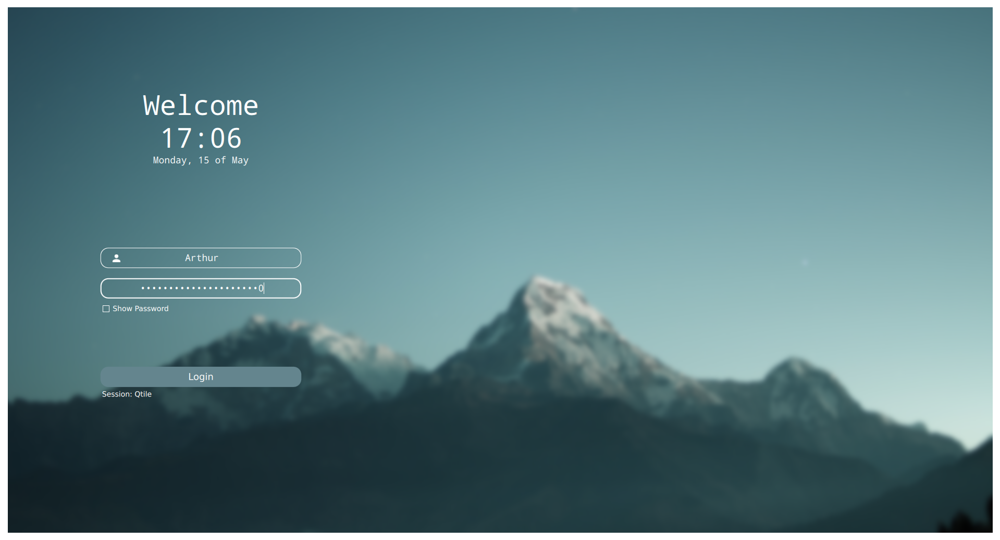
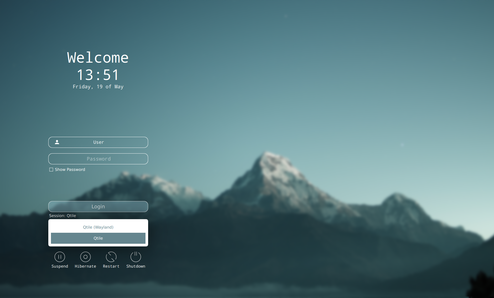

# SDDM Mountain Theme

SDDM Mountain Theme is a fork of [sddm-sugar-candy](https://github.com/kangie/sddm-sugar-candy) which i adjusted to my liking.

  
### Configuration

The sugar series, which this is based on, is **extremely customizable** by editing its included `theme.conf` file. You can change the colors and images used, the time and date formats, the appearance of the whole interface and even how it works.  

**Pro tip**: It's super annoying to log out and back in every time you want to see a change made to the `theme.conf` file. To preview your changes from withing your running desktop environment session simply issue:  
<pre>sddm-greeter --test-mode --theme /usr/share/sddm/themes/mountain</pre>  

And as if that wouldn't still be enough you can **translate every single button and label** because SDDM still [needs your help](https://github.com/sddm/sddm/wiki/Localization) to make localization as complete as possible!  

**`Background="Backgrounds/Mountain.jpg"`**  
*Path relative to the theme root directory. Most standard image file formats are allowed including support for transparency. (e.g. background.jpeg/illustration.GIF/Foto.png/undraw.svgz)*  

**`DimBackgroundImage="0.0"`**  
*Double between 0 and 1 used for the alpha channel of a darkening overlay. Use to darken your background image on the fly.*  

**`ScaleImageCropped="true"`**  
*Whether the image should be cropped when scaled proportionally. Setting this to false will fit the whole image instead, possibly leaving white space. This can be exploited beautifully with illustrations (try it with "undraw.svg" included in the theme).*  

**`ScreenWidth="1980"`**  
**`ScreenHeight="1020"`**  
*Adjust to your resolution to help SDDM speed up on calculations.*  

**`FullBlur="false"`**  
**`PartialBlur="true"`**  
*Enable or disable the blur effect; if HaveFormBackground is set to true then PartialBlur will trigger the BackgroundColor of the form element to be partially transparent and blend with the blur.*  

**`BlurRadius="50"`**  
*Set the strength of the blur effect. Anything above 100 is pretty strong and might slow down the rendering time. 0 is like setting false for any blur.*  

**`HaveFormBackground="false"`**  
*Have a full opacity background color behind the form that takes slightly more than 1/3 of screen estate;  if PartialBlur is set to true then HaveFormBackground will trigger the BackgroundColor of the form element to be partially transparent and blend with the blur.*  

**`FormPosition="center"`**  
*Position of the form which takes roughly 1/3 of screen estate. Can be left, center or right.*  

**`BackgroundImageHAlignment="center"`**  
*Horizontal position of the background picture relative to its visible area. Applies when ScaleImageCropped is set to false or when HaveFormBackground is set to true and FormPosition is either left or right. Can be left, center or right; defaults to center if none is passed.*  

**`BackgroundImageVAlignment="center"`**  
*As before but for the vertical position of the background picture relative to its visible area.*  

**`MainColor="#fff"`**  
*Used for all elements when not focused/hovered etc. Usually the best effect is achieved by having this be either white or a very dark grey like #444 (not black for smoother antialias). Colors can be HEX or Qt names (e.g. red/salmon/blanchedalmond). See [https://doc.qt.io/qt-5/qml-color.html](https://doc.qt.io/qt-5/qml-color.html)*  

**`AccentColor="#64858E"`**  
*Used for elements in focus/hover/pressed. Should be contrasting to the background and the MainColor to achieve the best effect.*  

**`BackgroundColor="#fff"`**  
*Used for the user and session selection background as well as for ScreenPadding and FormBackground when either is true. If PartialBlur and FormBackground are both enabled this color will blend with the blur effect.*  

**`OverrideLoginButtonTextColor=""`**  
*The text of the login button may become difficult to read depending on your color choices. Use this option to set it independently for legibility.*  

**`InterfaceShadowSize="6"`**  
*Integer used as multiplier. Size of the shadow behind the user and session selection background. Decrease or increase if it looks bad on your background. Initial render can be slow for values above 5-7.*  

**`InterfaceShadowOpacity="0.6"`**  
*Double between 0 and 1. Alpha channel of the shadow behind the user and session selection background. Decrease or increase if it looks bad on your background.*  

**`RoundCorners="15"`**  
*Integer in pixels. Radius of the input fields and the login button. Empty for square. Can cause bad antialiasing of the fields.*  

**`ScreenPadding="15"`**  
*Integer in pixels. Increase or delete this to have a padding of color BackgroundColor all around your screen. This makes your login greeter appear as if it was a canvas. Cool!*  

**`Font="Droid Sans Mono"`**  
*If you want to choose a custom font it will have to be available to the X root user. See https://wiki.archlinux.org/index.php/fonts#Manual_installation*  

**`FontSize=""`**  
*Only set a fixed value if fonts are way too small for your resolution. Preferrably kept empty.*  

**`ForceRightToLeft="false"`**  
*Revert the layout either because you would like the login to be on the right hand side or SDDM won't respect your language locale for some reason. This will reverse the current position of FormPosition if it is either left or right and in addition position some smaller elements on the right hand side of the form itself (also when FormPosition is set to center).*  

**`ForceLastUser="true"`**  
*Have the last successfully logged in user appear automatically in the username field.*  

**`ForcePasswordFocus="true"`**  
*Give automatic focus to the password field. Together with ForceLastUser this makes for the fastest login experience.*  

**`ForceHideCompletePassword="false"`**  
*If you don't like to see any character at all not even while being entered set this to true.*  

**`ForceHideSystemButtons="false"`**  
*Completely disable and hide any power buttons on the greeter.*  

**`AllowEmptyPassword="false"`**
*Enable login for users without a password. This is discouraged. Makes the login button always enabled.*

**`AllowBadUsernames="false"`**
*Do not change this! Uppercase letters are generally not allowed in usernames. This option is only for systems that differ from this standard! Also shows username as is instead of capitalized.*

**`Locale=""`**  
*The time and date locale should usually be set in your system settings. Only hard set this if something is not working by default or you want a seperate locale setting in your login screen.*  

**`HourFormat="HH:mm"`**  
*Defaults to Locale.ShortFormat - Accepts "long" or a custom string like "hh:mm A". See http://doc.qt.io/qt-5/qml-qtqml-date.html*  

**`DateFormat="dddd, d of MMMM"`**  
*Defaults to Locale.LongFormat - Accepts "short" or a custom string like "dddd, d 'of' MMMM". See http://doc.qt.io/qt-5/qml-qtqml-date.html*  

**`HeaderText="Welcome!"`**  
*Header can be empty to not display any greeting at all. Keep it short.*  

*SDDM may lack proper translation for every element. Mountain defaults to SDDM translations. Please help translate SDDM as much as possible for your language: https://github.com/sddm/sddm/wiki/Localization. These are in order as they appear on screen.*  

**`TranslatePlaceholderUsername=""`**  
**`TranslatePlaceholderPassword=""`**  
**`TranslateShowPassword=""`**  
**`TranslateLogin=""`**  
**`TranslateLoginFailedWarning=""`**  
**`TranslateCapslockWarning=""`**  
**`TranslateSession=""`**  
**`TranslateSuspend=""`**  
**`TranslateHibernate=""`**  
**`TranslateRestart=""`**  
**`TranslateShutdown=""`**  
**`TranslateVirtualKeyboardButton=""`**  
*These don't necessarily need to translate anything. You can enter whatever you want here.*  

  

